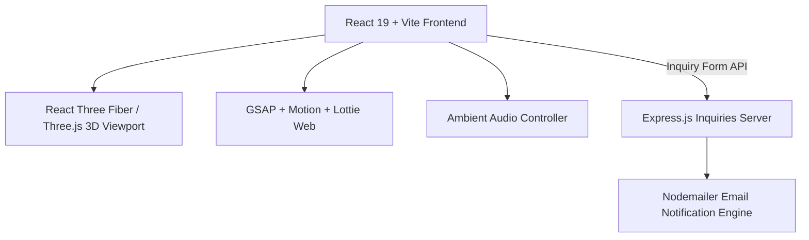

# 🏛️ Niraniya Heritage Stones — Luxury Stone Crafts & Architecture Portal

[](https://react.dev/)
[](https://vitejs.dev/)
[](https://threejs.org/)
[](https://tailwindcss.com/)
[](https://greensock.com/)

> **Niraniya Heritage Stones (Jaipur)** is a luxury architectural portfolio and client enquiry portal showcasing bespoke Rajasthani sandstone, marble craftsmanship, hand-carved temple artifacts, and monumental stonework with immersive 3D interactions and atmospheric ambient soundscapes.

---

## 💎 Design & User Experience Features

- **✨ 3D Interactive Showcases**: Built with Three.js and React Three Fiber (`@react-three/fiber`) for realistic lighting, depth, and material texturing.
- **🎨 Cinematic Typography & Micro-Interactions**: Custom GSAP and Motion animations, StarBorder glow effects, and typography animations (`BlurText`, `ShinyText`, `ScrollFloat`).
- **🎵 Atmospheric Heritage Audio**: Embedded devotional and traditional ambient soundscapes with seamless playback controls.
- **✉️ Automated Inquiries API**: Express.js backend with Nodemailer integration for customer requests and custom stone carving orders.
- **📱 Fully Responsive Luxury UI**: Mobile-optimized layouts, sleek dark palette, and custom silk canvas backdrops.

---

## 🏗️ Architecture Overview



---

## 🛠️ Tech Stack

| Domain | Technology |
|---|---|
| **Core Frontend** | React 19, Vite, JavaScript / TypeScript |
| **3D Rendering** | Three.js, React Three Fiber (`@react-three/fiber`) |
| **Animations & UI** | GSAP, Motion, Lottie Web, Tailwind CSS 4, Lucide React |
| **Backend Service** | Node.js, Express.js 5, Nodemailer, Dotenv |

---

## 🚀 Quick Start

```bash
# Clone the repository
git clone https://github.com/Harshxu/NiraniyaHeritageStones-Jaipur.git
cd NiraniyaHeritageStones-Jaipur

# Install dependencies
npm install

# Start both client and inquiry server concurrently
npm run dev
```
Visit `http://localhost:5173` in your browser.
